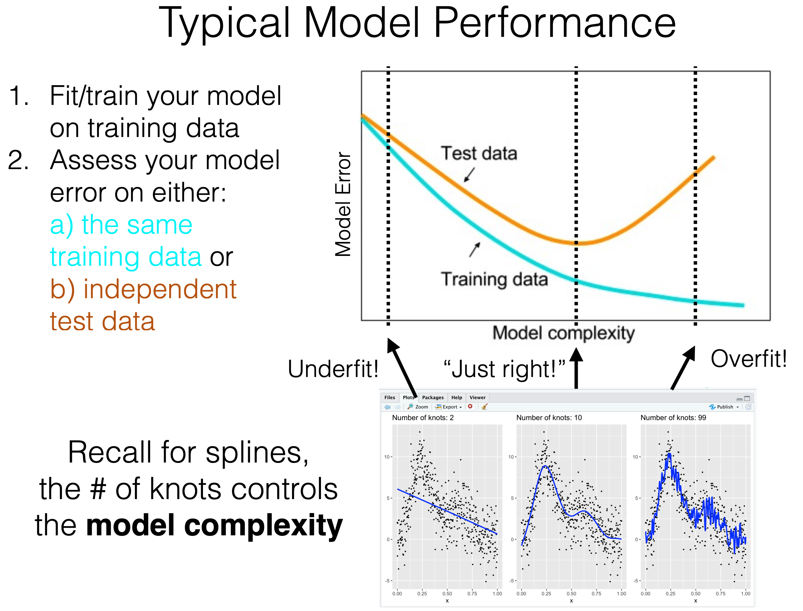

```{r setup, include=FALSE}
# Set default behavior for all code chunks here:
knitr::opts_chunk$set(
  echo = TRUE, 
  message = FALSE, 
  warning = FALSE, 
  fig.width = 16/2, 
  fig.height = 9/2
)

# Load all your used packages here:
library(tidyverse)
library(skimr)
library(janitor)
library(broom)
library(scales)
library(modelr)
library(glmnet)
library(Metrics)

# Set seed value of random number generator here:
set.seed(76)

# Load data 
training <- read_csv("data/train.csv")
test <- read_csv("data/test.csv")
sample_submission <- read_csv("data/sample_submission.csv")

# Load previously seen function with:
# Input: A LASSO model object
# Output: A tidy data frame of the beta-hat coefficients for each lambda value
get_LASSO_coefficients <- function(LASSO_fit){
  beta_hats <- LASSO_fit %>%
    tidy(return_zeros = TRUE) %>%
    select(term, estimate, lambda) %>%
    arrange(desc(lambda))
  return(beta_hats)
}
```

Note above that `data/train.csv` is now not the original training data with 1460 rows, but rather a randomly chosen 50 rows. We do this to artificially create a situation where $p$ is very large relative to $n$. Thus if we fit a model using all $p$ predictors, we are highly succeptible to fitting a highly overfit model.


***


# Preprocessing data

We do some variable cleaning to `training` and `test`. Note how for each step, we apply the changes for both the training and test sets. This is an important principle in machine learning: the training set must be representative of the test set!


## Clean variable names

Rename variables that start with a number, as such variable names can be problematic in R. 

```{r}
training <- training %>% 
  rename(
    FirstFlrSF = `1stFlrSF`,
    SecondFlrSF = `2ndFlrSF`,
    ThirdSsnPorch = `3SsnPorch`
  )

test <- test %>% 
  rename(
    FirstFlrSF = `1stFlrSF`,
    SecondFlrSF = `2ndFlrSF`,
    ThirdSsnPorch = `3SsnPorch`
  )
```


## Create new outcome variable

Just like we did in PS3 on CART, we are going to fit our models in log-space for many reasons:

1. To avoid situations where we obtain negative predicted values
1. To unskew the highly right-skewed original outcome variable `SalePrice`
1. The Kaggle score is RMSLE and not RMSE. So the following are roughly equivalent
1. "Fitting models to $y$ = `SalePrice` and using RMSLE as the score"
1. "Fitting models to $y$ = `logSalePrice` and using RMSE as the score"

```{r}
training <- training %>% 
  mutate(logSalePrice = log(SalePrice+1))
```

Questions to ask yourself or discuss with your peers

1. Why didn't I apply the same change to the `test` set?
1. If I transformed the outcome variable now, what will I have to make sure to do later on?


## Select only numerical predictors

To keep things simple, we're only going to focus on the 36 numerical predictor variables. Given this fact, it's good idea to select only the variables we are going to use. That way when you view them in RStudio's spreadsheet viewer, there is less cognitive load. Think of this as clearing off your desk before you start working.

```{r}
training <- training %>% 
  select(
    # Important non-predictor variables
    Id, SalePrice, logSalePrice,
    # All numerical predictor variables
    MSSubClass, LotFrontage, LotArea, OverallQual, OverallCond, YearBuilt, YearRemodAdd, 
    MasVnrArea, BsmtFinSF1, BsmtFinSF2, BsmtUnfSF, TotalBsmtSF, FirstFlrSF, SecondFlrSF, 
    LowQualFinSF, GrLivArea, BsmtFullBath, BsmtHalfBath, FullBath, HalfBath, BedroomAbvGr,
    KitchenAbvGr, TotRmsAbvGrd, Fireplaces, GarageYrBlt, GarageCars, GarageArea, WoodDeckSF, 
    OpenPorchSF, EnclosedPorch, ThirdSsnPorch, ScreenPorch, PoolArea, MiscVal, MoSold, YrSold
  )

test <- test %>% 
  select(
    # Important non-predictor variables
    Id,
    # All numerical predictor variables
    MSSubClass, LotFrontage, LotArea, OverallQual, OverallCond, YearBuilt, YearRemodAdd, 
    MasVnrArea, BsmtFinSF1, BsmtFinSF2, BsmtUnfSF, TotalBsmtSF, FirstFlrSF, SecondFlrSF, 
    LowQualFinSF, GrLivArea, BsmtFullBath, BsmtHalfBath, FullBath, HalfBath, BedroomAbvGr,
    KitchenAbvGr, TotRmsAbvGrd, Fireplaces, GarageYrBlt, GarageCars, GarageArea, WoodDeckSF, 
    OpenPorchSF, EnclosedPorch, ThirdSsnPorch, ScreenPorch, PoolArea, MiscVal, MoSold, YrSold
  )
```


## Deal with missing values

Many of these numerical predictors have missing values.

```{r, eval=FALSE}
skim(training)
skim(test)
```

An MVP approach to dealing with them is to replace them with the mean of the non-missing values". Note: I know there must be a better way to do this, in particular using the `purrr::map()` function, but done is better than perfect.

```{r}
training <- training %>% 
  mutate(
    LotFrontage = ifelse(is.na(LotFrontage), mean(LotFrontage, na.rm = TRUE), LotFrontage),
    GarageYrBlt = ifelse(is.na(GarageYrBlt), mean(GarageYrBlt, na.rm = TRUE), GarageYrBlt)
  )
test <- test %>% 
  mutate(
    LotFrontage = ifelse(is.na(LotFrontage), mean(LotFrontage, na.rm = TRUE), LotFrontage),
    MasVnrArea = ifelse(is.na(MasVnrArea), mean(MasVnrArea, na.rm = TRUE), MasVnrArea),
    BsmtFinSF1 = ifelse(is.na(BsmtFinSF1), mean(BsmtFinSF1, na.rm = TRUE), BsmtFinSF1),
    BsmtFinSF2 = ifelse(is.na(BsmtFinSF2), mean(BsmtFinSF2, na.rm = TRUE), BsmtFinSF2),
    BsmtUnfSF = ifelse(is.na(BsmtUnfSF), mean(BsmtUnfSF, na.rm = TRUE), BsmtUnfSF),
    TotalBsmtSF = ifelse(is.na(TotalBsmtSF), mean(TotalBsmtSF, na.rm = TRUE), TotalBsmtSF),
    BsmtFullBath = ifelse(is.na(BsmtFullBath), mean(BsmtFullBath, na.rm = TRUE), BsmtFullBath),
    BsmtHalfBath = ifelse(is.na(BsmtHalfBath), mean(BsmtHalfBath, na.rm = TRUE), BsmtHalfBath),
    GarageYrBlt = ifelse(is.na(GarageYrBlt), mean(GarageYrBlt, na.rm = TRUE), GarageYrBlt),    
    GarageCars = ifelse(is.na(GarageCars), mean(GarageCars, na.rm = TRUE), GarageCars),
    GarageArea = ifelse(is.na(GarageArea), mean(GarageArea, na.rm = TRUE), GarageArea)
  )
```


## Define model formulas

Recall from `LASSO.Rmd`, the two models $\widehat{y} = \widehat{f}(\vec{x})$ we discussed before we started discussing the actual LASSO method:

1. The "naive" model: $\widehat{y} = \overline{y} = \widehat{\beta}_0$. In other words, a linear regression model with only a fitted intercept.
1. The "full" linear regression model $\widehat{y} = \widehat{\beta}_0 + \widehat{\beta}_1 x_1 + \ldots \widehat{\beta}_p x_p$ using all $p$ = 36 numerical predictors

We define the model formulas here:

```{r}
model_formula_naive <- "logSalePrice ~ 1" %>% 
  as.formula()

model_formula_full <- "logSalePrice ~ MSSubClass + LotFrontage + LotArea + 
OverallQual + OverallCond + YearBuilt + YearRemodAdd + MasVnrArea + BsmtFinSF1 + 
BsmtFinSF2 + BsmtUnfSF + TotalBsmtSF + FirstFlrSF + SecondFlrSF + LowQualFinSF + 
GrLivArea + BsmtFullBath + BsmtHalfBath + FullBath + HalfBath + BedroomAbvGr + 
KitchenAbvGr + TotRmsAbvGrd + Fireplaces + GarageYrBlt + GarageCars + GarageArea + 
WoodDeckSF + OpenPorchSF + EnclosedPorch + ThirdSsnPorch + ScreenPorch + PoolArea + 
MiscVal + MoSold + YrSold" %>% 
  as.formula()
```


***


# Naive and full models

For the naive model, we will now perform the following five steps:

1. Fit/train a model $\widehat{f}$ to the training data
1. Using $\widehat{f}$, make predictions on the training data
1. Compute the RMSLE when making predictions on the same training data used to fit $\widehat{f}$. In other words, the blue curve below. Note: we can do this locally because we have the outcome variable `training$SalePrice`
1. Using $\widehat{f}$, make predictions on the test data
1. Obtain the RMSLE when making predictions on new independent test data. In other words, the orange curve below. Note: we must do this via a Kaggle submission because we do not have the outcome variable `test$SalePrice`

<center>
{ width=80% }
</center>

## Naive model

```{r}
# Step 1:
model_naive <- lm(model_formula_naive, data = training)

# Step 2:
training <- training %>% 
  mutate(
    logSalePrice_hat_naive = predict(model_naive, newdata = training),
    SalePrice_hat_naive = exp(logSalePrice_hat_naive) - 1
  )

# Step 3:
rmsle(actual = training$SalePrice, predicted = training$SalePrice_hat_naive)

# Step 4:
test <- test %>% 
  mutate(
    logSalePrice_hat_naive = predict(model_naive, newdata = test),
    SalePrice_hat_naive = exp(logSalePrice_hat_naive) - 1
  )

# Step 5:
test %>% 
  select(Id, SalePrice = SalePrice_hat_naive) %>% 
  write_csv(path = "data/submission_naive.csv")
```

We can see that the RMSLE is 0.41999, as seen in this screenshot. This score is worse than my best submission to date with a score of 0.20012.

{ width=100% }


## Your turn

For a score of 6/10, do the following:

1. Repeat the above 5 steps for the "full" linear regression model, including:
    1. Renaming all variables appropriately
    1. Taking a screen shot of your score as it appears on the leaderboard so that your login name appears
1. Compare all four RMSLE scores

## Full model

```{r}
# Step 1:

# Step 2:

# Step 3:

# Step 4:

# Step 5:

```

We can see that the RMSLE is Y, as seen this screenshot.


## Comparing all RMSLE scores

Model         | RMLSE on training  | RMLSE on test
------------- | ------------------ | -------------
Naive         | 0.3080035          | 0.41999
Full model    | X                  | Y


Comment on **why** we observe differences between the following pairs of scores:

1. Bottom left vs bottom right: 
1. Top left vs bottom left: 
1. Top right vs bottom right: 


***


# LASSO model for $\lambda$ = 0.001

For a score of 8/10 repeat all 5 steps above for a LASSO model $\widehat{f}$ called `model_LASSO_1` with complexity penalty/parameter $\lambda$ = 0.001. 

1. While the outline of the 5 steps will be the same as with the "naive" and "full" models, the code to fit LASSO models and make predictions will be very different. All the code you need is in `LASSO.R` and thus just needs to be modified.
1. For example, you'll need to define matrix representations of all $p$ predictor variables `x_matrix_train` and `x_matrix_test`, which is a little tricky. The good news is only need to do this once for this problem set.    

## Five steps

```{r}
lambda <- 0.001

# Step 1:

# Step 2:

# Step 3:

# Step 4:

# Step 5:
```

We can see that the RMSLE is XXX, as seen in this screenshot:


***


# LASSO model for $\lambda^*$

For a score of 9/10

1. Find the optimal $\lambda$ complexity penalty/parameter $\lambda^*$.
    1. Use the `glmnet` package's built-in function for cross-validation `cv.glmnet()`. In other words, you don't need to code your own cross-validation algorithm.
    1. Recall from Lec23 on Wednesday that this value $\lambda^*$ sets the optimal balance between model fit (as measured by RSS) and model complexity (as measured by the sum of absolutely value of slope coeffients $\widehat{\beta}_j$)
    1. You will need to search for $\lambda^*$ from a search grid of $\lambda$ values, just as you defined a search grid of $\alpha$ values for PS3 on CART.
1. Visualize the crossvalidation results with
    1. $y$ showing the estimated MSE. Note since you have log-transformed the outcome variable to `logSalePrice`, MSE's of `logSalePrice` correspond to MSLE's of `SalePrice`.
    1. $x$ showing your search grid of $\lambda$ values on a log10-scale. Note this is different than log10-transforming your $\lambda$ values
    1. The optimal $\lambda^*$ marked with a vertical line
1. Repeat the 5 steps above for a LASSO model `model_LASSO_star` with $\lambda^*$
    1. You can re-use the earlier defined matrix representations of all $p$ predictor variables `x_matrix_train` and `x_matrix_test`
1. Compare all 6 RMSLE scores


## Find $\lambda^*$

```{r}
# Hint: consider using this starting search grid of lambda values that increase on a log-scale from 10^-5 = 0.00001 to 10^3 = 1000
lambda_search_grid <- 10^seq(from = -5, to = 3, length = 100)

# Store cross validation results here:

# Save and display optimal lambda_star:

```

## Visualize cross-validation results

```{r}

```


## Five steps

```{r}
# Step 1:

# Step 2:

# Step 3:

# Step 4:

# Step 5:

```

## Comparing all RMSLE scores

We can see that the RMSLE is B, as seen in this screenshot.

Model         | RMLSE on training  | RMLSE on test
------------- | ------------------ | -------------
Naive         | 0.3080035          | 0.41999
Full model    | X                  | Y
lambda*       | A                  | B

Comment on **why** we observe differences between the following pairs of scores:

1. Middle left vs bottom left: 
1. Middle right vs bottom right: 
1. Bottom left vs bottom right (tricky): 


***


# Interpreting LASSO coefficients

For a score of 9.5/10

1. Output the "optimal" $\widehat{\beta}$ coefficients. In other words, output a table with
    1. Two columns: `term` (intercept and predictor variable names) and `estimate` (the fitted $\widehat{\beta}$ coefficients)
    1. Rows corresponding to all non-zero $\widehat{\beta}$ coefficients for the `model_LASSO_star` fitted model based on $\lambda^*$
1. Visualize the trajectory of all slope coefficients $\widehat{\beta}_1, \ldots, \widehat{\beta}_p$ with
    1. $y$ showing the fitted slope $\widehat{\beta}$ value.
    1. $x$ showing your search grid of $\lambda$ values on a log10-scale. Note this is different than log10-transforming your $\lambda$ values.
    1. The optimal $\lambda^*$ marked with a vertical line

Hint: You've done both of these things in `LASSO.R`.

## Output "optimal" $\widehat{\beta}$ coefficients

```{r}

```

# Visualize the trajectory of all slope coefficients

```{r}

```


***


# Variable selection

For a score of 10/10. Answer this question: If you could only use three predictor variables to predict `SalePrice`, which would they be? Show why.

